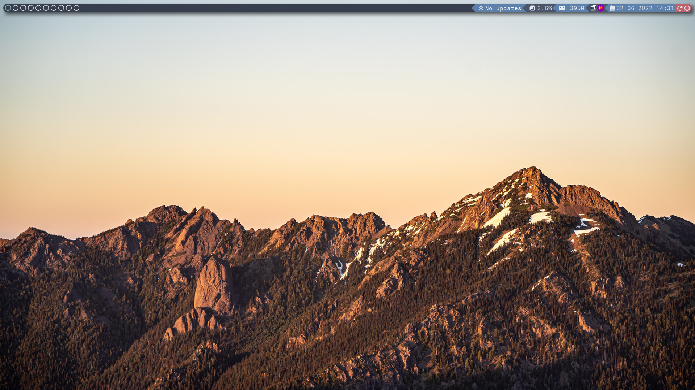
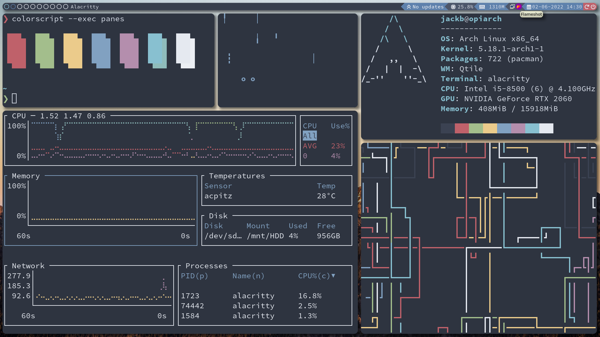

## Setup & Installtion

```bash
git clone <repo-url>
```
```bash
cd QtileDots2
```
```bash
yay -S - < packages.txt
```
```bash
sudo systemctl enable ly.service
```
```bash
mv .bashrc ~/
```
```bash
mkdir ~/.config
```
it's fine if it says it already exists
```bash
rm -r ~/.config/neofetch
```
```bash
mv -v .config/* ~/.config
```

```bash
chmod +x ~/.config/qtile/autostart.sh
```

```bash
reboot
```
